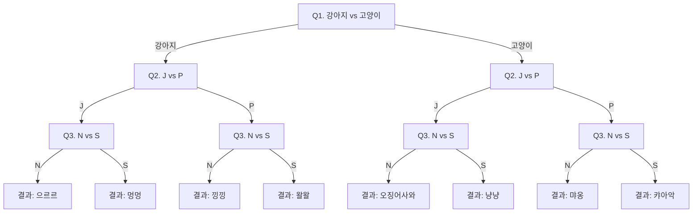

```mermaid
graph TD
  Q1["Q1. 강아지 vs 고양이"] -->|강아지| Q2A["Q2. J vs P"]
  Q1 -->|고양이| Q2B["Q2. J vs P"]

  Q2A -->|J| Q3A["Q3. N vs S"]
  Q2A -->|P| Q3B["Q3. N vs S"]

  Q3A -->|N| R1["결과: 으르르"]
  Q3A -->|S| R2["결과: 멍멍"]
  Q3B -->|N| R3["결과: 낑낑"]
  Q3B -->|S| R4["결과: 왈왈"]

  Q2B -->|J| Q3C["Q3. N vs S"]
  Q2B -->|P| Q3D["Q3. N vs S"]

  Q3C -->|N| R5["결과: 오징어사와"]
  Q3C -->|S| R6["결과: 냥냥"]
  Q3D -->|N| R7["결과: 먀옹"]
  Q3D -->|S| R8["결과: 캬아악"]
```
