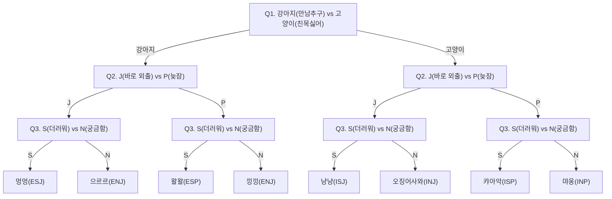

```mermaid
graph TD
  Q1["Q1. 강아지(만남추구) vs 고양이(친목싫어)"] -->|강아지| Q2A["Q2. J(바로 외출) vs P(늦잠)"]
  Q1 -->|고양이| Q2B["Q2. J(바로 외출) vs P(늦잠)"]

  Q2A -->|J| Q3A["Q3. S(더러워) vs N(궁금함)"]
  Q2A -->|P| Q3B["Q3. S(더러워) vs N(궁금함)"]

  Q3A -->|S| R1["멍멍(ESJ)"]
  Q3A -->|N| R2["으르르(ENJ)"]
  Q3B -->|S| R3["왈왈(ESP)"]
  Q3B -->|N| R4["낑낑(ENJ)"]

  Q2B -->|J| Q3C["Q3. S(더러워) vs N(궁금함)"]
  Q2B -->|P| Q3D["Q3. S(더러워) vs N(궁금함)"]

  Q3C -->|S| R5["냥냥(ISJ)"]
  Q3C -->|N| R6["오징어사와(INJ)"]
  Q3D -->|S| R7["캬아악(ISP)"]
  Q3D -->|N| R8["먀옹(INP)"]
```
